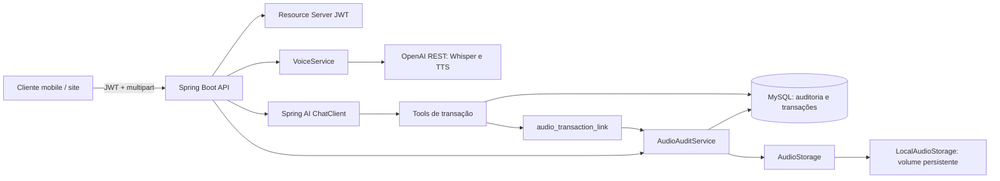
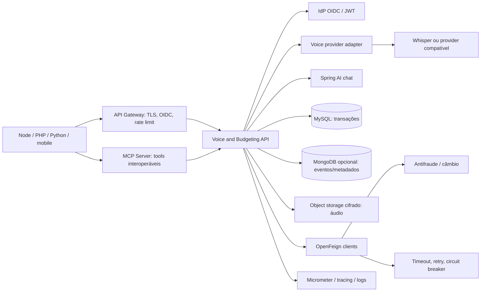

# Arquitetura

## Análise do estado anterior

O projeto já continha Spring Boot 4.1.1, Java 25, Spring AI 2.0.0-M4, integração OpenAI para chat/áudio, controllers de transação, chat, transcrição e síntese, casos de uso com tools, domínio de transação e persistência JPA/MySQL. O fluxo principal recebia áudio, chamava transcrição, enviava o texto ao ChatClient com tools de transação e gerava áudio de resposta. Os testes de provedor eram opt-in por `OPENAI_API_KEY`.

Antes desta entrega, a auditoria não existia, o esquema era atualizado por Hibernate, não havia autenticação, a chave OpenAI era solicitada interativamente no `main`, e os controllers dependiam diretamente de tipos de áudio do Spring AI. O fluxo principal ainda chamava síntese duas vezes.

## Arquitetura implementada

`VoiceService` desacopla controllers do fornecedor. `OpenAiDirectVoiceService` usa `RestClient` e endpoints HTTP de transcrição e fala; o chat continua usando Spring AI. `AudioStorage` é um port substituível; a implementação incluída é filesystem local. O SHA-256 e a storage key tornam verificável e localizável o arquivo original. O vínculo transação-áudio é persistido junto com a gravação da transação.

Flyway cria `transaction_entity`, `audio_operation_audit` e `audio_transaction_link`. `baseline-on-migrate` na versão 0 permite adotar a migração em schemas legados não vazios; as tabelas são criadas com `IF NOT EXISTS`. Hibernate executa `validate`, sem alterar schemas silenciosamente.

## Arquitetura alvo sugerida

A arquitetura alvo é uma proposta, não funcionalidade já entregue. Para este domínio, MySQL foi mantido como fonte de verdade de transações e auditoria, simplificando integridade referencial e associação atômica. MongoDB pode ser adicionado para eventos/metadados de alto volume, mas não foi incluído sem requisitos de consulta, retenção e consistência. Áudio deve migrar para storage de objeto privado e cifrado antes de produção distribuída.

## Plano de implementação

1. **Concluído nesta entrega:** remover captura interativa de segredo, impor JWT fail-closed e tornar a API stateless.
2. **Concluído nesta entrega:** persistir auditoria de upload, hash, storage key, canal, usuário, tempo, resultado e associação com transações criadas no fluxo de áudio.
3. **Concluído nesta entrega:** extrair `VoiceService`, chamar transcrição/síntese por HTTP direto e atualizar os testes opt-in de voz.
4. **Concluído nesta entrega:** timeout de conexão/leitura, tamanho máximo de upload, migração Flyway e validação do schema.
5. **Próxima etapa de produção:** trocar `LocalAudioStorage` por S3/MinIO ou equivalente com KMS, retenção e recuperação testadas.
6. **Próxima etapa de produção:** publicar MCP Server independente com tools versionadas e autorização delegada.
7. **Próxima etapa de produção:** adicionar OpenFeign + Resilience4j somente quando os contratos de antifraude/câmbio forem conhecidos; configurar métricas, tracing e alertas.
8. **Próxima etapa de produção:** aplicar rate limit distribuído no gateway, política de autorização por scopes/roles, audiência JWT e testes contra o IdP real.

## Estado de aderência

| Requisito | Estado |
| --- | --- |
| Auditoria de upload e rastreabilidade até arquivo original | Implementado para `/transactions/ai` e `/api/transcribe`; link para transações criadas pelo fluxo de tool. |
| Persistência não relacional | Não adotada; MySQL escolhido para preservar integridade relacional. Mongo é alternativa futura justificada por carga/consulta. |
| Storage dedicado | Interface e storage local implementados; storage de objeto gerenciado ainda pendente. |
| OAuth2/JWT | JWT Resource Server e negação sem issuer implementados. Scopes/roles e audience específicos ainda pendentes. |
| Rate limiting | Pendente; deve ser distribuído no gateway/ingress. |
| Criptografia/LGPD | Logging minimizado e limite de upload configurados; TLS, criptografia em repouso, retenção/eliminação e consentimento dependem de implantação/política. |
| OpenFeign e resiliência de integrações | Pendente; não existem contratos de serviços externos no repositório. Timeout existe apenas no adaptador de voz. |
| MCP Server | Pendente; documentado como serviço/adaptador independente. |
| Voz independente de Spring AI | Implementado para transcrição e síntese via `VoiceService` e REST direto. |
| Observabilidade | Logs verbosos de IA reduzidos; métricas, tracing distribuído e alertas pendentes. |
